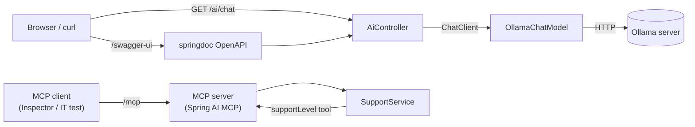

# AI

Demo application built for learning and playing around with Spring AI and Spring Boot.

## Architecture



## Running

Activate the `ollama` profile so Spring AI talks to a local [Ollama](https://ollama.com/) instance:

```
SPRING_PROFILES_ACTIVE=ollama ./mvnw spring-boot:run
```

Configure the model via `application-ollama.yaml`, overridable with `OLLAMA_BASE_URL` / `OLLAMA_CHAT_MODEL` env vars.

## Swagger UI

Once the app is running, browse the API at:

```
http://localhost:8080/swagger-ui/index.html
```

Raw OpenAPI spec: `http://localhost:8080/v3/api-docs`

## Tests

Includes a `McpServerIntegrationTest` that spins up the app and exercises the MCP server end-to-end over HTTP. Run all tests, integration included, with:

```
./mvnw test
```

## MCP Inspector

To test MCP tools from browser:

```
npx @modelcontextprotocol/inspector
```
