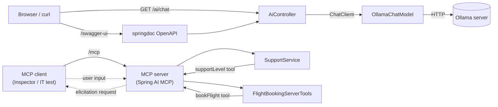

# AI

Demo application built for learning and playing around with Spring AI and Spring Boot.

## Architecture



## Running

Activate the `ollama` profile so Spring AI talks to a local [Ollama](https://ollama.com/) instance:

```
SPRING_PROFILES_ACTIVE=ollama ./mvnw spring-boot:run
```

Configure the model via `application-ollama.yaml`, overridable with `OLLAMA_BASE_URL` / `OLLAMA_CHAT_MODEL` env vars.

## Swagger UI

Once the app is running, browse the API at:

```
http://localhost:8080/swagger-ui/index.html
```

Raw OpenAPI spec: `http://localhost:8080/v3/api-docs`

## Tests

Includes a `McpServerIntegrationTest` that spins up the app and exercises the MCP server end-to-end over HTTP. Run all tests, integration included, with:

```
./mvnw test
```

## MCP Tools

- `supportLevel` (`SupportService`) — looks up support level by user email.
- `bookFlight` (`FlightBookingServerTools`) — books flight, demos **elicitation**.

### Elicitation example ("man in the middle")

`bookFlight` don't finish in one shot. Mid-execution, server pauses and sends `ElicitFormRequest` back to client, asking for seat preference (Window/Aisle). Client sits "in the middle" — must answer prompt before server resumes and completes booking.

```java
var formRequest = McpSchema.ElicitFormRequest.builder(
                "Please choose a seat preference",
                Map.of("type", "object",
                        "properties", Map.of("seatPreference",
                                Map.of("type", "string", "enum", List.of("Window", "Aisle"))),
                        "required", List.of("seatPreference")))
        .build();

McpSchema.ElicitResult result = context.elicit(formRequest);
```

Server blocks on `context.elicit(...)` til client responds. If action is `ACCEPT`, seat pref pulled from `result.content()` and flight booked; else booking cancelled. See `FlightBookingServerTools.java`.

Try it in MCP Inspector: call `bookFlight` tool, inspector prompts you for seat choice mid-call, then returns final booking message.

## MCP Inspector

To test MCP tools from browser:

```
npx @modelcontextprotocol/inspector
```
